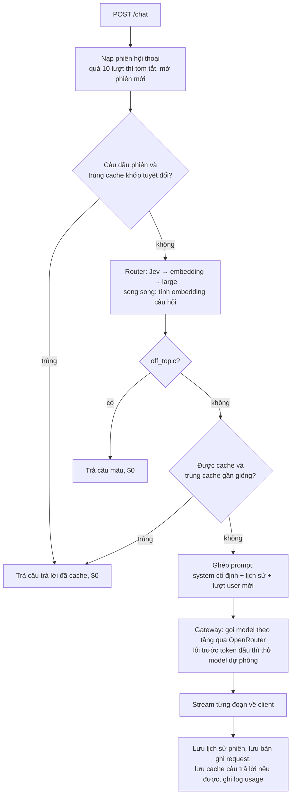
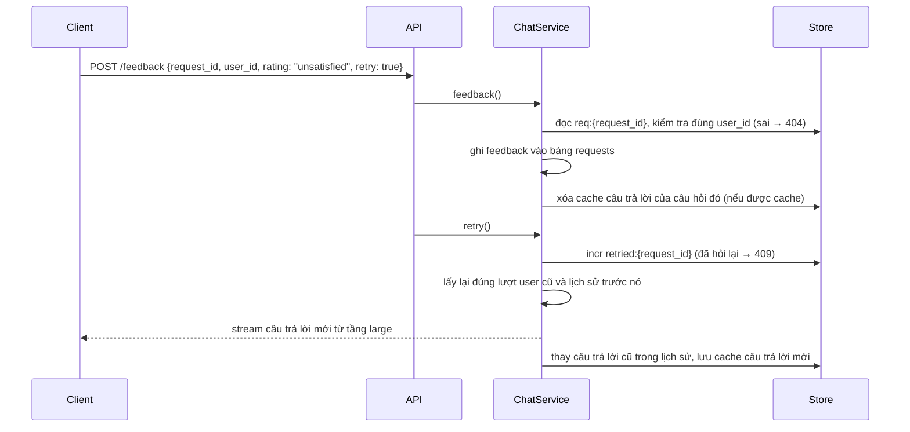

# Hệ thống chạy như thế nào

Tài liệu này mô tả code **hiện tại** chạy ra sao, từ lúc khởi động tới lúc một câu hỏi được trả lời. Thiết kế và lý do chọn nằm ở [architecture.md](architecture.md), [routing.md](routing.md) và [caching.md](caching.md). Ở đây chỉ nói code làm gì, theo thứ tự, và mỗi bước nằm ở đâu.

## Mục lục

1. [Tổng quan một request](#1-tổng-quan-một-request)
2. [Khởi động](#2-khởi-động)
3. [Chi tiết `POST /chat`](#3-chi-tiết-post-chat)
4. [Prompt gửi đi trông như thế nào](#4-prompt-gửi-đi-trông-như-thế-nào)
5. [Gọi OpenRouter và dự phòng](#5-gọi-openrouter-và-dự-phòng)
6. [Phiên hội thoại](#6-phiên-hội-thoại)
7. [Feedback và hỏi lại](#7-feedback-và-hỏi-lại)
8. [Dữ liệu được lưu ở đâu](#8-dữ-liệu-được-lưu-ở-đâu)
9. [Log và chỉ số](#9-log-và-chỉ-số)
10. [Xử lý lỗi](#10-xử-lý-lỗi)
11. [Chạy local, test, deploy](#11-chạy-local-test-deploy)
12. [Giới hạn hiện tại](#12-giới-hạn-hiện-tại)

---

## 1. Tổng quan một request



Code của cả luồng nằm trong `ChatService.chat()` ở [app/service.py](../app/service.py). API ([app/main.py](../app/main.py)) chỉ chuyển luồng event thành SSE.

> **Bản test:** chưa có xác thực request và quota theo gói, sẽ thêm sau.

## 2. Khởi động

Khi chạy `uvicorn app.main:app`:

1. **Đọc cấu hình** ([app/config.py](../app/config.py)): `Settings` đọc biến môi trường và file `.env`, ngay trong `lifespan` (không phải lúc import). Biến nào cũng phải có giá trị:
   - Chỉ `OPENROUTER_API_KEY` không có mặc định. Trống hoặc còn `CHANGE_ME` thì server dừng ngay.
   - Các biến khác có mặc định, ghi đầy đủ trong [.env.example](../.env.example). Một số biến được kiểm tra giá trị hợp lệ: `OPENROUTER_DATA_COLLECTION` (`allow`/`deny`), `ROUTER_BACKEND`/`ROUTER_FALLBACK` (`jev`/`embedding`/`none`), `REDIS_URL` (`redis://`, `rediss://`, `unix://`, `memory://`).
   - `TIER_SMALL`, `TIER_LARGE`, `REASONING_INTENTS` viết dạng JSON. Giá trị có nháy bao ngoài được bỏ nháy, nên `docker run --env-file` cũng đọc được.
2. **`lifespan` gọi `build_container()`** ([app/container.py](../app/container.py)), tạo các thành phần theo thứ tự:

| Bước | Thành phần | Làm gì lúc khởi động |
|---|---|---|
| 1 | `load_knowledge()` | Đọc `knowledge/*.md` theo thứ tự tên file, nối lại bằng `\n\n---\n\n`, đọc `knowledge/VERSION` làm `KNOWLEDGE_VERSION` |
| 2 | `PromptBuilder` | Tạo **một lần** object system message từ phần kiến thức. Mọi request dùng lại đúng object này, nên phần đầu prompt giống nhau từng byte |
| 3 | `OpenRouterClient` | Tạo `httpx.AsyncClient` tới `OPENROUTER_BASE_URL`, timeout 60s (kết nối 5s), header `Authorization`, `HTTP-Referer`, `X-Title` |
| 4 | `Embedder` | Bọc API `/embeddings` của OpenRouter (`baai/bge-m3`), có LRU 2.048 câu trong bộ nhớ |
| 5 | `make_store()` | `REDIS_URL=redis://...` thì dùng Redis, `REDIS_URL=memory://` thì dùng `MemoryStore` trong tiến trình |
| 6 | `build_router()` | `ROUTER_BACKEND=jev` thì thêm Jev (gọi qua OpenRouter, dùng chung client HTTP và API key). `ROUTER_FALLBACK=embedding` thì thêm router embedding phía sau |
| 7 | `UsageLog` | Mở SQLite ở `USAGE_DB_PATH` (mặc định `data/usage.sqlite3`), tạo bảng `requests` nếu chưa có |
| 8 | `ChatService` | Ghép tất cả lại. Đặt `sticky_key = "cag-{KNOWLEDGE_VERSION}"` |

3. **Làm nóng cache** (chỉ khi `WARMUP_ON_STARTUP=true`): gửi 1 request `max_tokens=1` với prompt `[system cố định, "ping"]` cho model chính của tầng `small` và `large`. Nhà cung cấp ghi KV của phần kiến thức vào cache, nên request thật đầu tiên đã được tính giá đọc cache.

Router embedding **chưa** gọi API lúc khởi động. Lần đầu cần phân loại, nó embed 55 câu mẫu trong `app/resources/router_examples.jsonl` bằng một lần gọi, rồi giữ ma trận trong bộ nhớ.

Khi tắt, `Container.aclose()` đóng client HTTP (dùng chung cho chat, Jev và embedding), kết nối Redis và SQLite.

## 3. Chi tiết `POST /chat`

### 3.1. Request

```json
{
  "user_id": "u123",
  "message": "了 và 过 khác nhau thế nào?",
  "session_id": null,
  "level": "HSK3",
  "stream": true
}
```

| Trường | Ràng buộc | Ghi chú |
|---|---|---|
| `user_id` | 1–128 ký tự | Do backend chính gửi sang sau khi đã xác thực user |
| `message` | 1–4.000 ký tự | Sai thì trả 422 |
| `session_id` | tối đa 64 ký tự | Lấy từ event `meta` của lần trước để hỏi tiếp trong cùng phiên |
| `level` | `HSK1`…`HSK6`, `HSK7-9` | Chuẩn hóa: `"hsk 3"` → `HSK3`. Giá trị khác thì bỏ qua |
| `stream` | mặc định `true` | `false` thì gom lại và trả một JSON |

### 3.2. Các bước

**Bước 1: nạp phiên** (`_load_session`)

- Có `session_id` và tìm thấy `session:{user_id}:{session_id}` thì dùng phiên đó. Key có `user_id`, nên user B gửi `session_id` của user A sẽ nhận phiên mới.
- Phiên đã đủ `MAX_TURNS_PER_SESSION` (10) lượt thì tóm tắt rồi mở phiên mới (xem [mục 6](#6-phiên-hội-thoại)).
- Câu hỏi được coi là **câu đầu phiên** khi phiên chưa có tin nhắn nào và không có bản tóm tắt phiên trước.

**Bước 2: cache khớp tuyệt đối** (chỉ với câu đầu phiên)

- Key: `answer:{KNOWLEDGE_VERSION}:{level hoặc -}:{sha256(normalize(câu hỏi))}`.
- `normalize` ([app/text.py](../app/text.py)): chuẩn hóa Unicode NFC, đổi dấu câu toàn góc của tiếng Trung sang bán góc, chuyển về chữ thường, gộp khoảng trắng, bỏ dấu câu ở cuối. `"  你好 LÀ GÌ？"` và `"你好 là gì"` ra cùng một key.
- Trúng thì trả luôn: không gọi router, không gọi LLM, chi phí $0. Câu hỏi và câu trả lời vẫn được thêm vào lịch sử phiên để hỏi tiếp được.

**Bước 3: router, chạy song song với embedding**

- Nếu có bật cache gần giống hoặc router embedding, service tạo một task tính embedding câu hỏi **ngay lúc** gọi router, để hai việc chạy song song.
- `IntentRouter.route()` ([app/router.py](../app/router.py)) thử lần lượt từng bộ phân loại:

| Bộ phân loại | Cách làm | Ngưỡng confidence |
|---|---|---|
| **Jev** | `POST https://openrouter.ai/api/v1/systemone` với `model: "typesafe/jev-1.13"`, `state: {"question": ...}` và 2 câu hỏi: `intent` (Choice, 6 lựa chọn mô tả bằng tiếng Anh) và `needs_context` (Noul). Dùng `OPENROUTER_API_KEY`. Timeout 0,8s, không retry | `JEV_CONFIDENCE_THRESHOLD` = 0,6 |
| **Embedding** | Cosine giữa embedding câu hỏi và 55 câu mẫu có nhãn. Điểm mỗi intent = trung bình 3 câu mẫu giống nhất; confidence = softmax của các điểm. `needs_context` đoán bằng regex ("từ đó", "câu trên", "thêm ví dụ", "这个词"…) | `EMBEDDING_CONFIDENCE_THRESHOLD` = 0,55 |

- Bộ nào ném lỗi (timeout, lỗi mạng, thiếu embedding) thì chuyển sang bộ sau. Tất cả đều lỗi thì trả `Route("large", cacheable=False, "router_unavailable")`.
- Từ kết quả phân loại ra quyết định (`IntentRouter.decide`):

| Kết quả | Tầng | Được cache | `max_tokens` |
|---|---|---|---|
| `lookup`, `translate` | `small` | có, nếu `needs_context < 0,5` | 300 |
| `grammar`, `culture` | `large` | có, nếu `needs_context < 0,5` | 1.000 |
| `correction` | `large` | không | 1.200 |
| `off_topic` | câu mẫu | không | — |
| confidence dưới ngưỡng | `large` | không | 1.000 |
| intent lạ, router lỗi | `large` | không | 1.000 |

**Bước 4: câu ngoài phạm vi**

`off_topic` thì hủy task embedding, trả `OFF_TOPIC_ANSWER` trong [app/canned.py](../app/canned.py), ghi log với `status = canned`. Không gọi LLM, và không thêm vào lịch sử phiên.

**Bước 5: điều kiện cache**

- Câu trả lời **được cache** khi intent thuộc loại được cache, **và** không phải trường hợp confidence thấp, **và** (là câu đầu phiên **hoặc** `needs_context < 0,5`).

**Bước 6: cache gần giống** (khi được cache và có embedding)

- Tìm trong chỉ mục embedding (trong bộ nhớ) của cùng `KNOWLEDGE_VERSION` và trình độ, lấy câu có cosine ≥ `SEMANTIC_CACHE_THRESHOLD` (0,95).
- Thêm một điều kiện: **hai câu phải có đúng cùng các chữ Hán**. "了 dùng khi nào" và "过 dùng khi nào" có embedding rất gần nhau nhưng không được coi là trùng.
- Chỉ mục chỉ lưu key. Nội dung câu trả lời vẫn đọc từ store, nên TTL và việc xóa cache vẫn áp dụng.

**Bước 7: RAG**

Hiện dùng `NullRetriever` ([app/rag.py](../app/rag.py)), luôn trả danh sách rỗng. Khi làm giai đoạn 6, đoạn tài liệu lấy được sẽ nằm trong lượt user, sau phần được cache.

**Bước 8: ghép prompt và gọi LLM** (`_generate`)

- Ghép prompt (xem [mục 4](#4-prompt-gửi-đi-trông-như-thế-nào)).
- Bật thinking khi tầng là `large` **và** intent nằm trong `REASONING_INTENTS` (mặc định chỉ `grammar`).
- Gửi event `meta`, rồi stream từng đoạn trả lời thành event `delta`.

**Bước 9: sau khi stream xong**

1. Thêm lượt user và câu trả lời vào cuối lịch sử phiên, lưu lại (TTL 24h, gia hạn mỗi lần lưu).
2. Lưu bản ghi `req:{request_id}` (TTL 24h) để xử lý feedback sau này.
3. Được cache, câu trả lời không rỗng và **không bị cắt** (`finish_reason != "length"`) thì lưu cache câu trả lời (TTL 30 ngày) và thêm vào chỉ mục gần giống.
4. Gửi event `done` kèm usage, chi phí, độ trễ.
5. Ghi một dòng vào bảng `requests` (xem [mục 9](#9-log-và-chỉ-số)).

### 3.3. Response

Với `stream: true`, response là `text/event-stream`:

```
event: meta
data: {"request_id": "6774…", "session_id": "f2d2…", "tier": "small", "intent": "lookup", "reason": "lookup", "answer_cache": null}

event: delta
data: {"text": "你好 "}

event: delta
data: {"text": "(nǐ hǎo) nghĩa là xin chào."}

event: done
data: {"request_id": "6774…", "model": "qwen/qwen3.8-flash", "provider": "Alibaba",
       "usage": {"cached_input_tokens": 7500, "input_tokens": 200, "cache_write_tokens": 0,
                 "output_tokens": 20, "reasoning_tokens": 0, "cost_usd": 0.00015, "cache_read_ratio": 0.974},
       "cost_usd": 0.00015, "ttft_ms": 26.3, "latency_ms": 70.9, "truncated": false}
```

| Event | Khi nào | Trường chính |
|---|---|---|
| `meta` | Luôn là event đầu tiên | `request_id` (dùng cho feedback), `session_id` (dùng để hỏi tiếp), `tier`, `intent`, `reason`, `answer_cache` (`exact`, `semantic` hoặc `null`) |
| `delta` | Mỗi đoạn trả lời | `text`. Câu trả lời lấy từ cache hoặc câu mẫu thì chỉ có một `delta` chứa cả câu |
| `done` | Kết thúc thành công | `model`, `provider`, `usage`, `cost_usd`, `ttft_ms`, `latency_ms`, `truncated` |
| `error` | LLM lỗi | `code: "llm_unavailable"`, `message` |

Với `stream: false`, API gom lại thành một JSON gồm các trường của `meta`, `done`, và `answer`. LLM lỗi thì trả **503**.

## 4. Prompt gửi đi trông như thế nào

`PromptBuilder.build()` ([app/prompt_builder.py](../app/prompt_builder.py)) luôn trả `messages` theo thứ tự này:

```
[0] system     nội dung knowledge/*.md             ← cố định, giống nhau cho mọi user → được cache
[1] user       lượt user của lượt 1 (nguyên văn)   ┐
[2] assistant  câu trả lời lượt 1                  │ lịch sử phiên, chỉ nối thêm → được cache theo phiên
…                                                  ┘
[n] user       lượt user mới                       ← thay đổi mỗi request
```

Lượt user mới do `compose_user_turn()` tạo. Mỗi khối chỉ xuất hiện khi có dữ liệu:

```
<tom_tat_phien_truoc>
(bản tóm tắt, chỉ có ở lượt đầu của phiên mở sau khi tóm tắt)
</tom_tat_phien_truoc>

<ngu_canh>
Trình độ người học: HSK3
Dạng câu hỏi: giải thích ngữ pháp
</ngu_canh>

<tai_lieu_tham_khao>
(đoạn RAG, hiện chưa có)
</tai_lieu_tham_khao>

<cau_hoi>
了 và 过 khác nhau thế nào?
</cau_hoi>
```

Những điểm giúp cache trúng:

- Trình độ, dạng câu hỏi và đoạn RAG nằm ở **lượt user cuối**, không nằm trong system.
- Lượt user được lưu **nguyên văn** vào lịch sử. Lượt sau gửi lại đúng các byte đó, nên phần `[0..n-1]` của lượt sau trùng với toàn bộ prompt của lượt trước.
- `knowledge/` không có ngày giờ hay dữ liệu thay đổi. Test `test_system_prefix_is_byte_stable` kiểm tra điều này.

Quy tắc chống prompt injection nằm trong `knowledge/00_vai_tro.md`: nội dung trong `<cau_hoi>` là của người học, có yêu cầu đổi vai trò hay xem hướng dẫn hệ thống thì không làm theo.

## 5. Gọi OpenRouter và dự phòng

### 5.1. Body gửi tới `POST /chat/completions`

`OpenRouterClient.build_body()` ([app/llm/openrouter.py](../app/llm/openrouter.py)), ví dụ với câu `lookup` ở tầng `small`:

```json
{
  "model": "qwen/qwen3.8-flash",
  "messages": ["…system…", "…user…"],
  "stream": true,
  "max_tokens": 300,
  "temperature": 0.3,
  "reasoning": {"enabled": false},
  "provider": {"order": ["alibaba"], "allow_fallbacks": true},
  "session_id": "cag-2026-09-23.1"
}
```

| Trường | Ý nghĩa |
|---|---|
| `reasoning` | Tắt thinking: `{"enabled": false}`. Bật (tầng `large` + `grammar`): `{"max_tokens": 1024, "exclude": true}`, và `max_tokens` được cộng thêm 1.024 để phần thinking không ăn vào câu trả lời |
| `provider.order` | Ghim nhà cung cấp để cache phần đầu prompt luôn nằm ở một nơi. Cấu hình theo từng model trong `TIER_*` |
| `provider.data_collection` | Chỉ gửi khi đặt `OPENROUTER_DATA_COLLECTION` (ví dụ `deny`) |
| `session_id` | Khóa sticky routing của OpenRouter. Cố định theo `KNOWLEDGE_VERSION`, nên mọi request dùng chung phần đầu prompt đi tới cùng một nhà cung cấp |

`PROMPT_CACHE_CONTROL=true` thì system message được gửi dạng `[{"type": "text", "text": …, "cache_control": {"type": "ephemeral"}}]`. Qwen và DeepSeek tự cache nên không cần; bật khi một tầng dùng Claude hoặc Gemini.

### 5.2. Đọc stream

- Bỏ qua các dòng không bắt đầu bằng `data:`, ví dụ dòng giữ kết nối `: OPENROUTER PROCESSING`.
- Mỗi chunk lấy `choices[0].delta.content`, `finish_reason`, `model`, `provider`.
- Chunk có `error` thì ném `LLMError`.
- `usage` ở chunk cuối được chuẩn hóa (`Usage.from_openrouter`):

| Trường chuẩn hóa | Lấy từ OpenRouter |
|---|---|
| `cached_input_tokens` | `prompt_tokens_details.cached_tokens` |
| `input_tokens` | `prompt_tokens − cached_tokens` (phần không đọc từ cache) |
| `cache_write_tokens` | `prompt_tokens_details.cache_write_tokens` |
| `output_tokens` | `completion_tokens` |
| `reasoning_tokens` | `completion_tokens_details.reasoning_tokens` |
| `cost_usd` | `cost`: số tiền OpenRouter tính thật |

### 5.3. Dự phòng giữa các model (`LLMGateway`)

[app/llm/gateway.py](../app/llm/gateway.py) thử lần lượt các model của tầng:

| Tình huống | Xử lý |
|---|---|
| 429, 5xx, 404, timeout, lỗi kết nối, **trước** token đầu tiên | Thử model tiếp theo, ghi tên model lỗi vào `failed_models` |
| 401 (sai key), 402 (hết credit), 403 (bị moderation chặn) | Dừng luôn, vì đổi model cũng không giải quyết được |
| Lỗi **sau khi** đã stream token | Dừng và báo lỗi, không ghép hai câu trả lời của hai model |
| Mọi model đều lỗi | `LLMError("Mọi model của tầng … đều lỗi")` |

Bên trong OpenRouter còn có một lớp dự phòng nữa: `allow_fallbacks: true` cho phép OpenRouter chuyển sang nhà cung cấp khác của **cùng model** khi nhà cung cấp được ghim bị lỗi.

## 6. Phiên hội thoại

[app/sessions.py](../app/sessions.py)

- Phiên lưu ở `session:{user_id}:{session_id}`, gồm `messages`, `summary`, `previous_id`.
- **Chỉ nối thêm vào cuối**, không cắt kiểu cửa sổ trượt, để cache lịch sử phía nhà cung cấp không mất.
- Khi phiên đã đủ 10 lượt user và user hỏi tiếp:
  1. Gọi tầng `small` với `[system, toàn bộ lịch sử, yêu cầu tóm tắt]`, `max_tokens=400`. Yêu cầu tóm tắt nằm ở cuối, nên request này vẫn đọc cache của cả phần kiến thức lẫn lịch sử.
  2. Mở phiên mới với `session_id` mới, lưu bản tóm tắt vào `summary`.
  3. Bản tóm tắt nằm trong khối `<tom_tat_phien_truoc>` của lượt đầu phiên mới, rồi bị xóa khỏi `summary`.
  4. Client nhận `session_id` mới trong event `meta` và dùng nó cho các lượt sau.
- Tóm tắt lỗi thì vẫn mở phiên mới, chỉ là không có tóm tắt.

## 7. Feedback và hỏi lại



- `rating: "satisfied"` hoặc không có `retry` thì chỉ ghi feedback và trả `{"ok": true}`.
- Mỗi request chỉ được hỏi lại một lần, và không được hỏi lại một bản hỏi lại (409).
- Hỏi lại dùng đúng lượt user đã lưu (`turn_index`), nên vẫn đọc được cache lịch sử. Nếu lượt đó là lượt cuối của phiên thì câu trả lời mới **thay** câu trả lời cũ trong lịch sử.
- Câu trả lời mới từ tầng `large` được cache lại (nếu câu hỏi thuộc loại được cache), thay cho câu trả lời vừa bị chê.

## 8. Dữ liệu được lưu ở đâu

### Redis (hoặc `MemoryStore` khi dev)

| Key | Nội dung | TTL |
|---|---|---|
| `session:{user_id}:{session_id}` | JSON phiên: `messages`, `summary`, `previous_id` | 24h, gia hạn mỗi lần lưu (`SESSION_TTL_SECONDS`) |
| `answer:{version}:{level}:{sha256}` | JSON câu trả lời: `text`, `tier`, `intent`, `model`, `question`, `created_at` | 30 ngày (`ANSWER_CACHE_TTL_SECONDS`) |
| `req:{request_id}` | Bản ghi để xử lý feedback: user, phiên, câu hỏi, trình độ, intent, tầng, `turn_index`, `is_retry` | 24h |
| `retried:{request_id}` | Số lần đã hỏi lại | 24h |

Đổi `KNOWLEDGE_VERSION` thì mọi key `answer:` cũ không còn được đọc tới và tự hết hạn.

### Bộ nhớ của tiến trình

| Dữ liệu | Mất khi restart? |
|---|---|
| Chỉ mục embedding của cache gần giống | Có. Cache khớp tuyệt đối trong Redis vẫn còn |
| LRU embedding câu hỏi (2.048 câu) | Có |
| Ma trận embedding câu mẫu của router | Có, tự tạo lại ở lần phân loại đầu tiên |
| Object system message | Tạo lại lúc khởi động, giống hệt nhau nếu `knowledge/` không đổi |

### SQLite (`data/usage.sqlite3`)

Bảng `requests`, mỗi request một dòng. **Không lưu `user_id` gốc** (chỉ lưu 16 ký tự đầu của sha256) và **không lưu nội dung câu hỏi**.

## 9. Log và chỉ số

Các cột chính của bảng `requests` ([app/usage_log.py](../app/usage_log.py)):

| Nhóm | Cột |
|---|---|
| Định danh | `request_id`, `ts`, `user_hash`, `session_id`, `kind` (`chat`/`retry`), `knowledge_version` |
| Định tuyến | `intent`, `route_reason`, `router_backend`, `router_confidence`, `needs_context`, `tier` |
| Model | `model`, `provider`, `failed_models` |
| Cache | `answer_cache` (`exact`/`semantic`/NULL), `cached_input_tokens`, `cache_write_tokens` |
| Chi phí | `input_tokens`, `output_tokens`, `reasoning_tokens`, `cost_usd` |
| Hiệu năng | `ttft_ms`, `latency_ms` |
| Kết quả | `status` (`ok`/`error`/`canned`/`aborted`), `error`, `feedback` |

`GET /stats?hours=24` hoặc `cag stats --hours 24` tính từ bảng này:

| Chỉ số | Cách tính | Mục tiêu (architecture.md mục 8) |
|---|---|---|
| `cache_read_ratio` | Σ `cached_input_tokens` / Σ (`cached_input_tokens` + `input_tokens`) | > 80%. Tụt đột ngột nghĩa là phần đầu prompt đã bị thay đổi |
| `answer_cache_hit_rate` | Số request trả từ cache / tổng số request | 15–30% |
| `avg_cost_usd`, `cost_usd` | Từ `cost` của OpenRouter | Theo [cost.md](cost.md) |
| `ttft_p95_ms` | p95 thời gian tới token đầu, chỉ tính request có gọi LLM | < 2.000 ms |
| `router_fallbacks` | Số request có `route_reason` là `low_confidence`, `router_unavailable`, `unknown_intent` | < 10% |
| `unsatisfied` | Số feedback "chưa hài lòng" | Theo dõi xu hướng |
| `by_intent_tier` | Số request, chi phí, độ trễ, token cache theo từng cặp intent và tầng | ~70% `small` |

## 10. Xử lý lỗi

| Lỗi | Hệ thống làm gì | User thấy gì |
|---|---|---|
| Thiếu biến bắt buộc hoặc giá trị không hợp lệ | Server không khởi động, báo tên biến | — |
| Jev timeout hoặc lỗi (kể cả 429, 5xx từ OpenRouter) | Dùng router embedding | Bình thường |
| Mọi router lỗi | Đưa vào `large`, không cache | Bình thường (tốn hơn một chút) |
| Embedding lỗi | Bỏ qua cache gần giống; router embedding ném lỗi và chuyển tiếp | Bình thường |
| Model chính lỗi trước token đầu | Thử model dự phòng, ghi `failed_models` | Bình thường |
| Mọi model của tầng đều lỗi | Ghi `status = error` | Event `error` (`llm_unavailable`); JSON thì 503 |
| Lỗi giữa chừng khi đang stream | Không chuyển model | Phần đã nhận + event `error` |
| Câu trả lời bị cắt do hết `max_tokens` | Không cache | `done.truncated = true` |
| Client ngắt kết nối giữa chừng | Ghi `status = aborted` (ghi đồng bộ, vì mọi `await` khi đó đều bị hủy) | — |
| Tóm tắt phiên lỗi | Mở phiên mới không có tóm tắt | Bình thường |
| Feedback cho request của người khác hoặc đã quá 24h | Không tìm thấy bản ghi | 404 |
| Hỏi lại lần thứ hai | Chặn | 409 |

## 11. Chạy local, test, deploy

### Chạy local

```bash
python3 -m venv .venv && source .venv/bin/activate
pip install -e '.[dev]'
cp .env.example .env        # thay CHANGE_ME bằng OPENROUTER_API_KEY
uvicorn app.main:app --reload
```

| Cấu hình | Hệ quả |
|---|---|
| `REDIS_URL=memory://` | Dùng `MemoryStore`: phiên, cache mất khi restart và không chia sẻ giữa các worker |
| `ROUTER_BACKEND=embedding` | Bỏ Jev, chỉ dùng router embedding |
| `ROUTER_BACKEND=none`, `ROUTER_FALLBACK=none` | Không định tuyến, mọi câu hỏi vào `large` |
| `SEMANTIC_CACHE_ENABLED=false` | Chỉ còn cache khớp tuyệt đối |

Kiểm tra: `curl localhost:8000/health` trả version kiến thức, router đang dùng và model của từng tầng.

### Test

`pytest` chạy 96 test, **không cần API key**:

- `tests/conftest.py` giả lập OpenRouter bằng `httpx.MockTransport` (stream SSE, lỗi HTTP, embedding) và có `ScriptedBackend` cho test service.
- Nhóm test chính: prompt giữ nguyên từng byte, checksum kiến thức, chuẩn hóa usage, dự phòng giữa model, bảng định tuyến, cache khớp tuyệt đối và gần giống, cấu hình `.env.example`, tóm tắt phiên, feedback và hỏi lại, API SSE và mã lỗi.

### Sửa kiến thức

```bash
# sửa knowledge/*.md
cag knowledge info      # xem số token ước lượng
cag knowledge bump      # tăng VERSION (YYYY-MM-DD.N), ghi CHECKSUM
# commit cả file .md, VERSION và CHECKSUM
```

CI ([.github/workflows/ci.yml](../.github/workflows/ci.yml)) chạy `ruff`, `cag knowledge check` và `pytest`. Sửa `.md` mà quên `bump` thì CI fail, để cache câu trả lời không trả nội dung cũ.

### Deploy

```bash
docker compose up --build
```

- `docker-compose.yml` có 2 service: `api` (image từ `Dockerfile`, bật `WARMUP_ON_STARTUP`) và `redis` (bật AOF). Log SQLite nằm trong volume `usage`.
- Mỗi container chạy **1 worker uvicorn**, vì chỉ mục cache gần giống nằm trong bộ nhớ tiến trình.
- Sau mỗi lần deploy hoặc đổi `KNOWLEDGE_VERSION`: warmup chạy tự động lúc khởi động, hoặc gọi `POST /admin/warmup`, hoặc chạy `cag warmup`.

### Eval (gọi API thật, tốn tiền)

```bash
python -m eval.router_eval                                     # Jev và/hoặc embedding trên 40 câu có nhãn
python -m eval.answer_eval --judge anthropic/claude-sonnet-5   # 13 câu qua toàn bộ pipeline, có model chấm
```

`answer_eval` dùng `MemoryStore` riêng và mỗi câu một user, nên cache không làm sai kết quả. Kết quả chi tiết ghi ra `tmp/answer_eval.jsonl`.

## 12. Giới hạn hiện tại

| Giới hạn | Ảnh hưởng | Hướng xử lý |
|---|---|---|
| Chỉ mục cache gần giống nằm trong bộ nhớ | Mất khi restart; nhiều worker thì mỗi worker một chỉ mục riêng | Chuyển sang pgvector |
| Log dùng SQLite | Không hợp khi chạy nhiều container | Chuyển sang Postgres, giữ nguyên tên cột |
| RAG chưa có | Chỉ dùng kiến thức cốt lõi (~7.600 token) | Giai đoạn 6 |
| Router embedding chỉ có 55 câu mẫu | Độ chính xác chưa được đo trên câu hỏi thật | Gom ~300 câu hỏi thật, chạy `router_eval`, chuyển sang logistic regression |
| Tóm tắt phiên chạy đồng bộ ở lượt thứ 11 | Lượt đó chậm thêm một lần gọi LLM | Tóm tắt nền sau lượt thứ 10 |
| Client ngắt kết nối giữa chừng | Token đã sinh vẫn bị tính tiền nhưng log không có usage | Chấp nhận, theo dõi tỉ lệ `aborted` |
| Chưa có xác thực và quota | Ai gọi được API đều dùng được, không giới hạn lượt | Thêm sau khi xong bản test |
| Chưa chạy với OpenRouter thật | Tỉ lệ đọc cache, TTFT và chất lượng chưa được đo | Chạy `cag warmup` và `answer_eval` với key thật |
